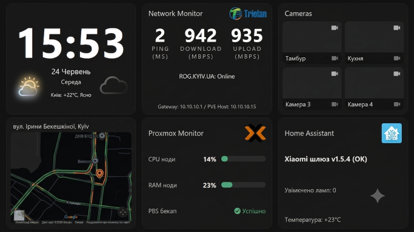

# eNode

> **Self-Displaying Node** — part of the [NodeWall](https://github.com/NodeWall/NodeWall.Tech) ecosystem.

## Beyond the Headless Server: The Interactive HomeLab Node

Most servers run headless — a black box you only touch over SSH. **eNode goes further than that paradigm.** It turns a commodity x86 machine with a screen into a node whose own display shows a real GUI — rendered by a container living *inside* the same host.

Not a thin client. Not a wall tablet. The server itself becomes the interface.

## Architectural Pillars

### 🖥️ Local Display Streaming
Instead of the **standard console**, the host's screen renders a full HTML page served from the node's own LXC. This is not GPU passthrough — it is display streaming: the host runs a bare X server, the LXC shares the X socket, and a Chromium kiosk inside the container paints the UI straight onto the monitor.

Works with **any** display. A touchscreen is just a bonus interaction layer — the core idea works on a plain monitor too. Point it at the Proxmox Web UI and the machine boots into a real management console, not a shell.

### 🧱 Monolithic Two-Tier Design
eNode runs a strict, resource-optimized monolith — no Desktop Environment, no network chaos:

- **Tier 1 — Physical Host (Proxmox VE):** Provides KVM/LXC, allocates the framebuffer, launches a bare X server, and passes the graphics socket + input devices into the container.
- **Tier 2 — Monolithic LXC:** Contains *everything* — the Node.js/Fastify backend, static UI assets, metrics collection, and the Chromium kiosk that renders the interface onto the host's display.

### 🎯 Hub & Spoke Dashboard (example workload)
The display layer is generic — it can show *any* web UI. A reference **Hub & Spoke** dashboard demonstrates this: a persistent home surface (`Slot0`) with widgets that launch full web interfaces of services you already run (Proxmox, PBS, Home Assistant, OMV, and anything else with a web UI). The dashboard is a showcase, not the core — the core is the display streaming itself.

## Affordability

eNode is built on second-life hardware. Example units tested by the project (used eBay finds, prices vary — these were rare low bids, not average market rates):

| Device | Spec | Acquired |
| :--- | :--- | :--- |
| Dell 7275 2-in-1 | m5 / 8 GB / 128 GB SATA | ~$45 |
| Dell 7285 2-in-1 | i7-7Y75 / 16 GB / 256 GB NVMe | ~$67 |
| HP Elite x2 G4 | i5-8365U / 16 GB / 256 GB SATA | ~$85 |
| HP Elite x2 G8 | i7-1185G7 / 16 GB / 256 GB SATA | ~$125 |

Second-life x86 with a display is dramatically cheaper than enterprise rack gear — and becomes a self-controlled interactive node instead of e-waste.

## Status

🚧 **Active Development.** eNode is a core project of the NodeWall ecosystem, maturing toward public disclosure. This repository presents the architecture and vision.

## Connect

- 🌐 [nodewall.tech](https://nodewall.tech/)
- 📫 nodewall.tech@gmail.com
- 🐙 GitHub: [NodeWall](https://github.com/NodeWall)
- 👥 Reddit: [NodeWall-Tech](https://www.reddit.com/user/NodeWall-Tech/)

---

© 2026 NodeWall. Part of the NodeWall ecosystem.
